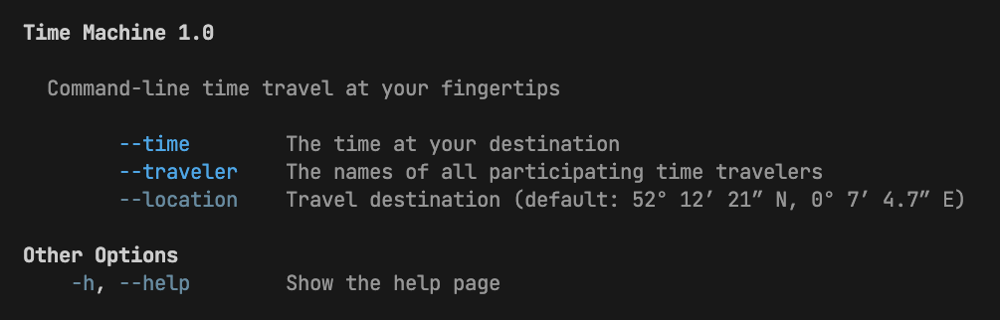
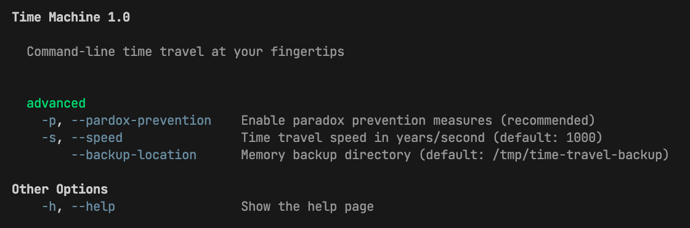

# Command Line Argument Manager

This library provides a straightforward way to declare and parse command line
options and sub-commands for a deno program.

It comes with the following features:

- Input validation
- Type-safe definitions
- Default arguments
- Resolution of relative paths arguments
- Automatic help page display in CLI (`--help`)
- Automatic help file generation (`--generate-help`)

With this library, it is possible for multiple modules in a program to declare
and access their own command line arguments at the same time.

This libary is based on <https://deno.land/std/flags/mod.ts>.

## Defining Command Line Options

```typescript
// Example: time-machine.ts

// create a CommandLineOptions instance
const options = new CommandLineOptions(
  "Time Machine 1.0",
  "Command-line time travel at your fingertips",
);

// declare options and get their values at runtime
const location = options.option("location", {
  type: "string",
  default: "52° 12’ 21” N, 0° 7’ 4.7” E",
  description: "Travel destination",
});

const time = options.option("time", {
  type: "string",
  required: true,
  description: "The time at your destination",
});

const travelers = options.option("traveler", {
  type: "string",
  required: true,
  multiple: true,
  description: "The names of all participating time travelers",
});

// capture options (optional, but--help)
await CommandLineOptions.capture();

// log the provided options
console.log({
  time,
  travelers,
  location,
});
```

> [!NOTE] The command line options should always be defined at the top-level
> scope of a module before any other program logic is done.
>
> It is recommended to use `CommandLineOptions.capture()` at the end of the
> options declaration to prevent unexpected behaviour when running the program
> with `--help`. The program is guaranteed to stop running beyond this point
> when starting it with `--help`.

Now you can run the program and pass arguments, e.g.:

```bash
deno run -A ./time-machine.ts --time "June 28, 2009" --traveler "Stephen Hawking" --traveler "Albert Einstein"
```

The options are printed out:

```js
{
  time: "June 28, 2009",
  travelers: [ "Stephen Hawking", "Albert Einstein" ],
  location: "52° 12’ 21” N, 0° 7’ 4.7” E"
}
```

The help page can also be display by starting the program with the `--help`
option (Other options are ignored in this case):

```bash
deno run -A ./time-machine.ts --help
```



## Defining Custom Sub-Commands with Options

```typescript
// Example: time-machine-2.ts

// create a CommandLineOptions instance
const options = new CommandLineOptions(
  "Time Machine 1.0",
  "Command-line time travel at your fingertips",
);

// declare commands with options and get their values at runtime
const advancedTravelOptions = options.command("advanced", {
  "pardox-prevention": {
    type: "boolean",
    aliases: ["p"],
    description: "Enable paradox prevention measures (recommended)",
  },

  "speed": {
    type: "number",
    default: 100,
    aliases: ["s"],
    description: "Time travel speed in years/second",
  },

  "backup-location": {
    type: "URL",
    default: "/tmp/time-travel-backup",
    description: "Memory backup directory",
  },
});

// capture options
await CommandLineOptions.capture();

// log the provided options
console.log(advancedTravelOptions);
```

> [!NOTE] You can also define more than one sub-command with multiple
> `option.command()` declarations.

The program can now be started with the `advanced` subcommand and the declared
options:

```shell
$ deno run -A ./time-machine-2.ts advanced --speed 4000 --backup-location ../backups/
```

This produces the following output:

```js
{
  "pardox-prevention": false,
  "speed": 1000,
  "backup-location": URL {"/home/marty/backups/"}
}
```

If the program is called with a different or no command, `advancedTravelOptions`
is `null`.

The help page for this option declaration looks like this:


## Generating the static help page file

The builtin `--help` command can always be used to print the help page. It
registers all provided sub-commands and options at runtime and exits the program
as soon as possible.

This works fine in most cases, but it has two disadvantages:

- Every time the help page is displayed, the program has to run until the point
  where all top-level command line options are defined
- Any command line options that are not defined at the top-level (e.g. loaded
  asynchronously or conditionally) will not be captured and displayed

This can be prevented by generating a static help file that can be used as a
cache when running `--help`. This file also serves a human-readable help
document.

In this scenario, custom command line options that are not immediately
initialized at the top level scope might not yet be loaded and not shown on the
help page.

For this reason, this tool allows you to generate a static help page, `RUN.md`
which also serves as a human readable help document.

To generate or update this file, run your program with the `--generate-help`
option. The file is named `RUN.md` and will be generated in the current working
directory.
